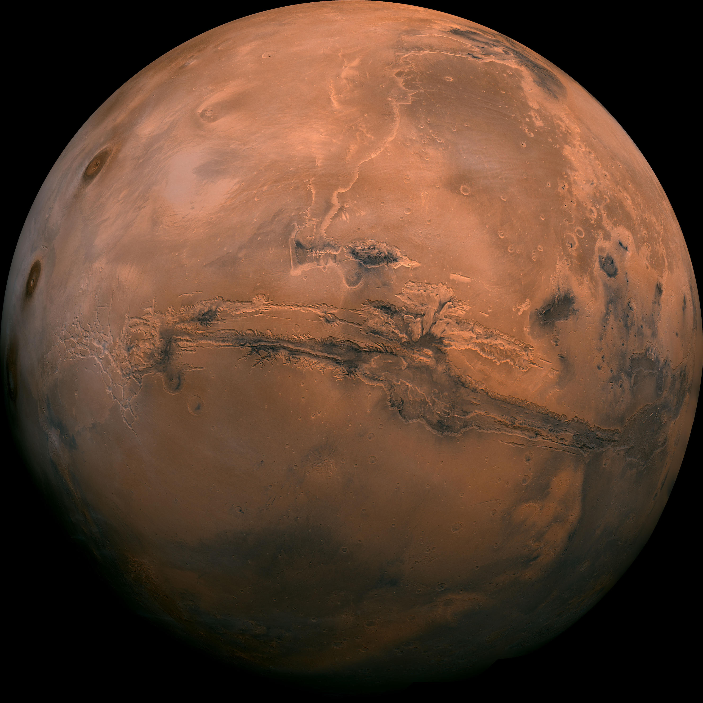

# <div align="center">🔴 Mars Cydonia Connection 🔴</div>

<div align="center">
  
  <p><em>Explore the mysteries of Cydonia on Mars - home to the famous Face and Pyramid structures</em></p>
</div>

<div align="center">

[](https://www.cydonia-project.net)
[](https://en.wikipedia.org/wiki/Mars)
[](https://en.wikipedia.org/wiki/Cydonia_(Mars))

</div>

## 🌌 About The Project

The **Mars Cydonia Connection** is a comprehensive web platform dedicated to exploring the enigmatic Cydonia region on Mars. This region gained worldwide attention after NASA's Viking 1 orbiter captured images in 1976 showing what appears to be a humanoid face and pyramid-like structures.

This project aims to:
- Present scientific data and historical information about the Cydonia region
- Explore the famous "Face on Mars" and surrounding structures
- Provide a timeline of discoveries and missions related to Cydonia
- Create a community for researchers and enthusiasts interested in Mars anomalies

Whether you're a scientist, researcher, or simply curious about the mysteries of our neighboring planet, this website offers valuable resources and insights into one of Mars' most fascinating regions.

## 🚀 Features

- **Interactive Timeline**: Trace the history of Cydonia discoveries from 1976 to present day
- **Detailed Galleries**: High-resolution images of the Face on Mars, pyramids, and other structures
- **Educational Content**: In-depth articles about Mars geology and the Cydonia region
- **FAQ Section**: Answers to common questions about Cydonia and Mars research
- **Newsletter**: Stay updated with the latest discoveries and research
- **Responsive Design**: Optimized viewing experience across all devices

## 🛠️ Technologies Used

- **HTML5**: Modern semantic markup
- **CSS3**: Advanced styling with animations and responsive design
- **JavaScript**: Interactive elements and dynamic content
- **Font Awesome**: Icon library for enhanced visual elements
- **Google Fonts**: Typography optimization with Roboto font family

## 📋 Project Structure

```
Cydonia-Project/
├── css/
│   └── style.css         # Main stylesheet
├── html/
│   ├── index.html        # Main content page
│   ├── about.html        # About Mars page
│   └── services.html     # About Cydonia page
├── img/
│   ├── Mars.jpg          # Main Mars background image
│   ├── face_mars.png     # Face on Mars image
│   └── ...               # Other project images
├── js/
│   └── app.js            # JavaScript functionality
├── index.html            # Redirect to main page
├── about.html            # Redirect to about page
├── services.html         # Redirect to services page
└── README.md             # Project documentation
```

## 🚀 Getting Started

### Prerequisites

- Any modern web browser (Chrome, Firefox, Safari, Edge)
- Basic understanding of web technologies (for development)

### Installation

1. Clone the repository:
   ```bash
   git clone https://github.com/yourusername/Cydonia-Project.git
   ```

2. Navigate to the project directory:
   ```bash
   cd Cydonia-Project
   ```

3. Open `index.html` in your browser or set up a local server:
   ```bash
   # Using Python's built-in server
   python -m http.server
   ```

4. Visit `http://localhost:8000` in your browser

## 🔭 Usage

- **Explore the Timeline**: Learn about the chronological discovery of Cydonia structures
- **View Image Galleries**: Examine high-resolution images of the Face and Pyramids
- **Read Articles**: Gain insights into Mars geology and the significance of Cydonia
- **Join the Community**: Subscribe to the newsletter and connect with fellow researchers
- **Contact the Team**: Reach out with questions or to contribute research

## 🤝 Contributing

Contributions are what make the open-source community such an amazing place to learn, inspire, and create. Any contributions you make are **greatly appreciated**.

1. Fork the Project
2. Create your Feature Branch (`git checkout -b feature/AmazingFeature`)
3. Commit your Changes (`git commit -m 'Add some AmazingFeature'`)
4. Push to the Branch (`git push origin feature/AmazingFeature`)
5. Open a Pull Request

## 📜 License

This project is licensed under the MIT License - see the LICENSE file for details.

## 📞 Contact

Michael Piotrowski - [info@cydonia-project.net](mailto:info@cydonia-project.net)

Project Website: [https://www.cydonia-project.net](https://www.cydonia-project.net)

## 🌟 Acknowledgements

- NASA for providing Mars imagery and data
- The scientific community researching Mars anomalies
- All contributors and supporters of the Cydonia Project

---

<div align="center">


<p>Mars Cydonia Connection &copy; 2025 | Created by Michael Piotrowski</p>
</div>
